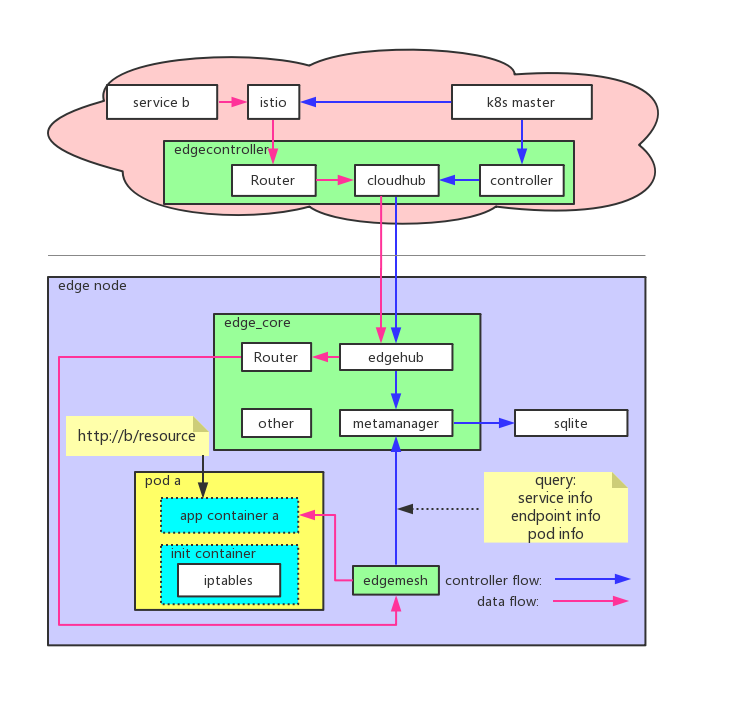

## 用户体验
随着微服务框架的流行和边缘节点计算和网络能力的增强，把部分服务部署到边缘处理设备产生的数据轻松解决时延的问题。但由于安全等原因，大多数服务仍然运行在云上。**云**跟**边**、**边**跟**边**之间的协同是必须要解决的问题，edgemesh正是为此而生。用户通过**服务名称**来访问通过kubeedge部署的服务，甚至脱离于kubeedge的自维护服务，而不需要关心服务部署到哪里


## 节点内协同


- 在k8s中创建Service，设置selector
- edgecontroller watch到Service/Endpoint的事件，同步到edgehub，经metamanager保存到sqlite
- 用户边缘应用A请求用户应用B时，流量通过iptables规则全部劫持到edgemesh
- edgemesh解析应用层协议，调用metamanager查询Service/Endpoint/Pod等相关信息，根据负载均衡等策略选择目的地址，转发请求到同节点的用户边缘应用B

## 边边协同


- 在k8s中创建Service，设置selector
- edgecontroller watch到Service/Endpoint的事件，同步到edgehub，经metamanager保存到sqlite
- 用户边缘应用A跨节点请求用户边缘应用B时，流量通过iptables规则全部劫持到edgemesh
- edgemesh解析应用层协议，调用metamanager查询Service/Endpoint/Pod等相关信息，根据负载均衡等策略选择目的地址，封装请求为```"beehive/pkg/core/model".Message```格式并转发请求到目的节点的edgemesh
- 目的节点edgemesh解析```"beehive/pkg/core/model".Message```并根据配置的QPS策略处理请求，转发请求到用户边缘应用B

## 边云协同


- 在k8s中创建Service，设置selector;创建Router Endpoint/Rule（数据结构见<a href="#### Router">Router</a>）
- edgecontroller watch到Service/Endpoint的事件：
    - 根据Router Endpoint/Rule在edgecontroller的Router中创建Rule
    - 同时同步到edgehub，经metamanager保存到sqlite
- 用户应用A请求用户云上服务B时，流量通过iptables规则全部劫持到edgemesh
- edgemesh解析应用层协议，调用metamanager查询Service/Endpoint/Pod等相关信息，根据负载均衡等策略选择目的地址，封装请求为```"beehive/pkg/core/model".Message```转发到edge_core中的Router然后转发到edgecontroller的Router
- edgecontroller中的Router解析```"beehive/pkg/core/model".Message```根据配置的QPS策略处理请求，转发请求到用户云上服务B

### 云边协同



- 在k8s中创建Service，设置selector；创建Router Endpoint/Rule（数据结构见<a href="#### Router">Router</a>）
- edgecontroller watch到Service/Endpoint的事件：
    - 同步Router Endpoint/Rule到edgehub，根据Router Endpoint/Rule在edge_core的Router中创建Rule
    - 同步Service/Endpoint到edgehub，经metamanager保存到sqlite
- 用户云上服务B请求用户边缘应用A时，流量经过istio，根据负载均衡等策略选择目的地址，封装成```"beehive/pkg/core/model".Message```格式并转发到Router
- Router转发流量到edgehub，edgehub解析```"beehive/pkg/core/model".Message```并转发到edgemesh
- edgemesh解析应用层协议，调用metamanager查询Service/Endpoint/Pod等相关信息，根据服务端QPS配置处理请求
- 转发请求到用户边缘应用A

## edgemesh内部实现


- edgemesh在tcp server之上（tcp server）
- 从tcp connection中拿到数据后，猜测并最终确认上层协议（resolvers）
- edgemesh还会启动多种协议的server，用于接收请求然后根据配置实现服务端QPS（transport server）
- 通过socket方式调用metamanager接口查询Service/Endpoint/Pod等元数据（metamanager的元数据由云上的edgecontroller watch k8s master后同步），根据配置的路由/负载均衡/QPS/熔断等策略处理请求
- 转发请求：
    - 目的地址是本节点应用的直接使用对应协议客户端转发到本节点edgemesh的对应协议server，根据服务端QPS策略处理请求
    - 目的地址是跨节点应用的封装请求为```"beehive/pkg/core/model".Message```格式并通过edgehub转发到目的节点edgemesh的对应协议server，根据服务端QPS策略处理请求
    - 目的地址是云上服务的封装请求为```"beehive/pkg/core/model".Message```格式并通过edgehub转发到云上的edgecontroller，再转发到目的服务
- 通过对应请求的客户端转发请求到用户边缘应用

### 附录
#### Router
##### Endpoint
```go
// Endpoint define how to access external service
type Endpoint struct {
	// ID is the ID of the endpoint
	ID         string    `orm:"column(id); size(36); pk" json:"id" yaml:"id"`
	// Type is type of the endpoint
	Type       string    `orm:"column(type); size(64)" json:"type" yaml:"type"`
	// Name is name of the endpoint
	Name       string    `orm:"column(name); size(64)" json:"name" yaml:"name"`
	// ProjectID can be used to differentiate endpoints across projects
	ProjectID  string    `orm:"column(project_id); size(36); index; null" json:"project_id" yaml:"project_id"`
	// IsShared is flag to check if endpoint is shared
	IsShared   bool      `orm:"column(is_shared); default(false)" json:"is_shared" `
	// Properties is map used to store properties of an Endpoint
	Properties Map       `orm:"column(properties); size(10240)" json:"properties" yaml:"properties"`
	// CreatedAt is endpoint creation timestamp
	CreatedAt  time.Time `orm:"column(created_at); auto_now_add; type(datetime)" json:"created_at" `
	// UpdatedAt is last endpoint updation timestamp
	UpdatedAt  time.Time `orm:"column(updated_at); auto_now; type(datetime)" json:"updated_at" `
	// Rule is reverse mapping of Rules of this endpoint
	Rule       []*Rule   `orm:"reverse(many)" json:"-"`
}
```
##### Rule
```go
// Rule define message translate from Endpoint to Endpoint
type Rule struct {
	// ID is unique id of rule
	ID              string    `orm:"column(id); size(36); pk" json:"id" yaml:"id"`
	// Name is the name of the Rule
	Name            string    `orm:"column(name); size(64)" json:"name" yaml:"name"`
	// ProjectID can be used to differentiate rules across projects
	ProjectID       string    `orm:"column(project_id); size(36); index" json:"project_id" yaml:"project_id"`
	// DomainID is the domain from where the source is accessed
	DomainID        string    `orm:"column(domain_id); size(36); index" json:"domain_id" yaml:"domain_id"`
	// Source is the source Endpoint
	Source          *Endpoint `orm:"column(source); rel(fk)" json:"source" yaml:"source"`
	// SourceResource is a map used to store resources required for source
	SourceResource  Map       `orm:"column(source_resource); size(1024)" json:"source_resource" yaml:"source_resource"`
	// Target is target endpoint
	Target          *Endpoint `orm:"column(target); rel(fk)" json:"target" yaml:"target"`
	// TargetResource is a map used to store resources required for target
	TargetResource  Map       `orm:"column(target_resource); size(1024)" json:"target_resource" yaml:"target_resource"`
	// InUse is flag to check if rule is in use
	InUse           bool      `orm:"column(in_use); default(true)" json:"in_use" yaml:"in_use"`
	// IsDeleted is flag to check if rule is deleted
	IsDeleted       bool      `orm:"column(is_deleted); default(false)" json:"is_deleted" `
	// CreatedAt is rule creation timestamp
	CreatedAt       time.Time `orm:"column(created_at); auto_now_add; type(datetime)" json:"created_at" `
	// UpdatedAt is last rule updation timestamp
	UpdatedAt       time.Time `orm:"column(updated_at); auto_now; type(datetime)" json:"updated_at" `
	// SuccessMessages is the number of success messages for this rule
	SuccessMessages uint64    `orm:"column(success_messages); default(0)" json:"success_messages" `
	// FailMessages in the number of fail messages for this rule
    FailMessages    uint64    `orm:"column(fail_messages); default(0)" json:"fail_messages" `
    // Error is reverse maping of error messages for this rule
    Error           []*Error  `orm:"reverse(many)" json:"-"`
```