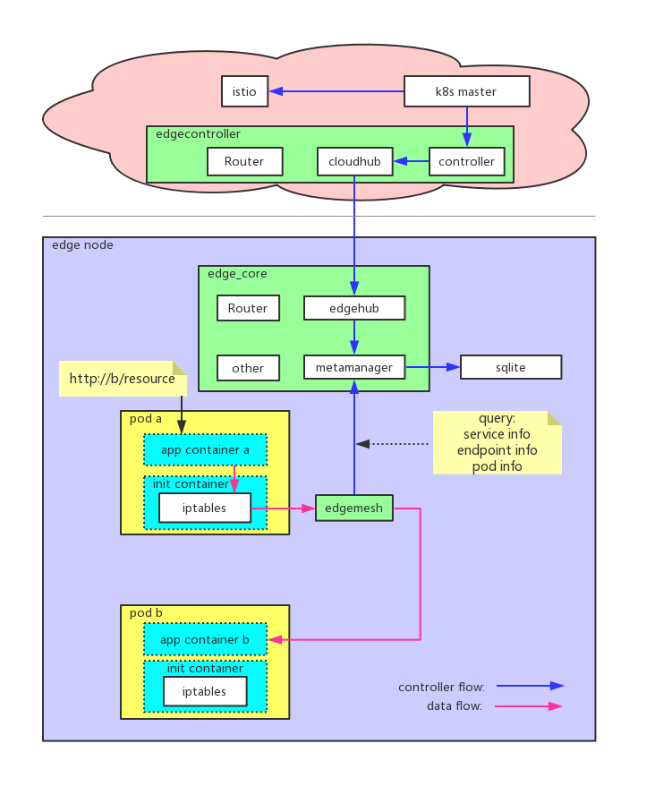
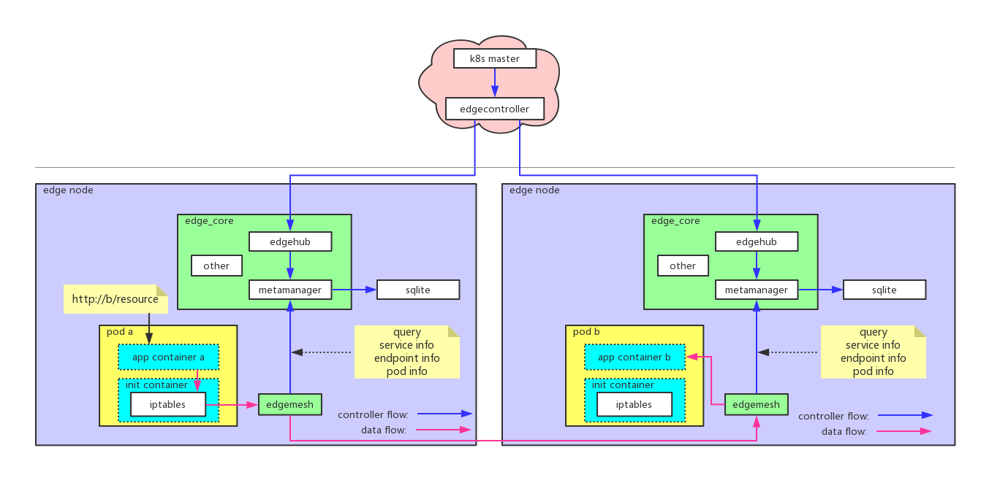
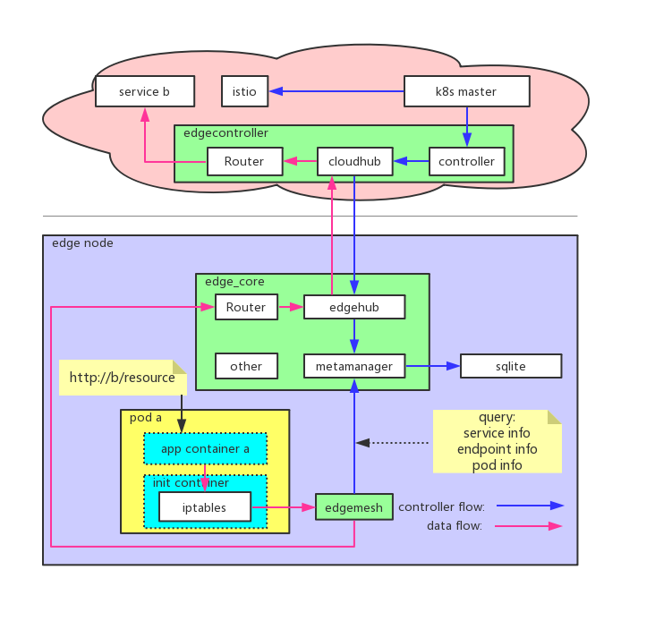

## 用户体验
随着微服务框架的流行和边缘节点计算和网络能力的增强，把部分服务部署到边缘处理设备产生的数据轻松解决时延的问题。但由于安全等原因，大多数服务仍然运行在云上。**云**跟**边**、**边**跟**边**之间的协同是必须要解决的问题，edgemesh正是为此而生。用户通过**服务名称**来访问通过kubeedge部署的服务，甚至脱离于kubeedge的自维护服务，而不需要关心服务部署到哪里


## 节点内协同



- 在k8s中创建Service，设置label
- edgecontroller watch到Service的事件，同步到edgehub，经metamanager保存到sqlite
- 用户应用A请求用户应用B时，流量通过iptables规则全部劫持到edgemesh
- edgemesh解析应用层协议，调用metamanager查询Service/Endpoint/Pod等相关信息，根据负载均衡等策略选择目的地址，转发请求到同节点的用户边缘应用B

## 边边协同



- 在k8s中创建Service，设置label
- edgecontroller watch到Service的事件，同步到edgehub，经metamanager保存到sqlite
- 用户应用A跨接点请求用户应用B时，流量通过iptables规则全部劫持到edgemesh
- edgemesh解析应用层协议，调用metamanager查询Service/Endpoint/Pod等相关信息，根据负载均衡等策略选择目的地址，封装请求为```"beehive/pkg/core/model".Message```并转发请求到目的节点的edgemesh
- 目的节点edgemesh解析```"beehive/pkg/core/model".Message```并根据配置的QPS策略处理请求，转发请求到用户边缘应用B

## 边云协同



- 在k8s中创建Service，设置label
- edgecontroller watch到Service的事件，同步到edgehub，经metamanager保存到sqlite
- 用户应用A跨接点请求用户云上服务B时，流量通过iptables规则全部劫持到edgemesh
- edgemesh解析应用层协议，调用metamanager查询Service/Endpoint/Pod等相关信息，根据负载均衡等策略选择目的地址，封装请求为```"beehive/pkg/core/model".Message```并转发到edgecontroller
- edgecontroller解析```"beehive/pkg/core/model".Message```根据配置的QPS策略处理请求，转发请求到用户云上服务B

## edgemesh内部实现


- edgemesh在tcp server之上（tcp server）
- 从tcp connection中拿到数据后，猜测并最终确认上层协议（resolvers）
- edgemesh还会启动多种协议的server，用于接收请求然后根据配置实现服务端QPS（transport server）
- 通过socket方式调用metamanager接口查询Service/Endpoint/Pod等元数据（metamanager的元数据由云上的edgecontroller watch k8s master后同步），根据配置的路由/负载均衡/QPS/熔断等策略处理请求
- 转发请求：
    - 目的地址是本节点应用的直接使用对应协议客户端转发到本节点edgemesh的对应协议server，根据服务端QPS策略处理请求
    - 目的地址是跨节点应用的封装请求为```"beehive/pkg/core/model".Message```格式并通过edgehub转发到目的节点edgemesh的对应协议server，根据服务端QPS策略处理请求
    - 目的地址是云上服务的封装请求为```"beehive/pkg/core/model".Message```格式并通过edgehub转发到云上的edgecontroller，再转发到目的服务
- 通过对应请求的客户端转发请求到用户边缘应用